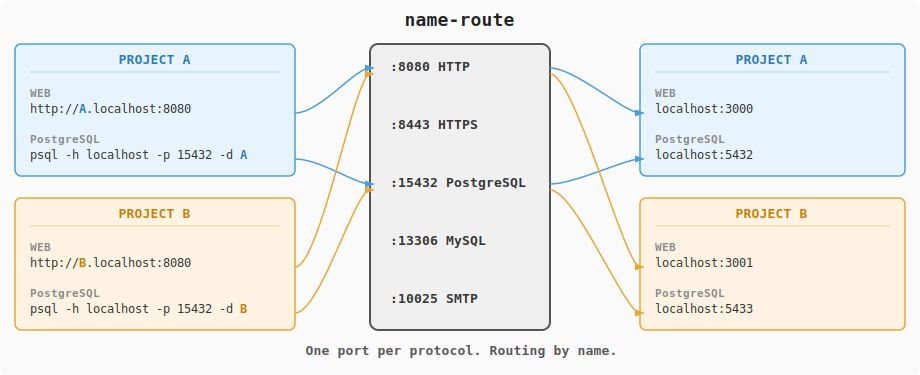

[English](../../README.md)

# name-route

## Name it. Route it.

複数プロジェクトの同時開発や、AIによる並列開発では、管理するポートが増え続けます。
name-route は、ポート番号の代わりに「名前」でアクセスできるようにするローカル開発専用のルーティングツールです。
覚えるポートはプロトコルごとに一つだけ。あとはデータベース名やホスト名を指定するだけで、適切なサービスに自動でつながります。

> **Note:** name-route はローカル環境での利用を前提に設計されています。
> 外部公開やプロダクション環境での使用は想定していません。


## How it works

<p align="center">
  
</p>

プロトコルごとに1つのポートを覚えるだけで、あとは名前で振り分けます。

- **HTTP** — `http://A.localhost:8080` のように、サブドメインがルーティングキーになる
- **PostgreSQL / MySQL** — 接続先のデータベース名がルーティングキーになる
- **SMTP** — `smtp://B.localhost:10025` のように、宛先ドメインがルーティングキーになる

バックエンドの実ポートが何番でも、開発者が意識するのは名前だけです。


## Features

- **5つのプロトコル対応** — HTTP, HTTPS, PostgreSQL, MySQL, SMTP をプロトコルレベルで解析してルーティング
- **HTTPS (passthrough / terminate)** — デフォルトは passthrough（TLS をバックエンドにそのまま転送、証明書不要）。terminate モードでは mkcert 等の証明書で TLS を終端し、バックエンドに HTTP で転送
- **WebSocket 透過** — HTTP プロキシは透過リレーのため、WebSocket（Next.js HMR 等）がそのまま動作
- **`nameroute run`** — 空きポート自動割り当て + ルート自動登録。ポート番号の管理から解放
- **Docker 自動検出** — コンテナのラベルからルートを自動登録。起動・停止に追従
- **Discovery** — プロジェクトごとの `.nameroute.toml` を自動検出。Git 管理可能
- **静的ルート** — TOML 設定ファイルで Docker を使わないサービスも登録可能
- **マルチレベルサブドメイン** — `api.myapp.localhost` のような多段サブドメインに対応
- **設定なしで起動** — デフォルトで全プロトコルのリスナーが立ち上がる。設定ファイルは任意
- **/etc/hosts 自動管理** — HTTP ルートに対応するホスト名を自動で追加・削除（root 時。ブラウザのみなら不要）
- **シングルバイナリ** — 依存なし。1ファイルを置くだけで動作


## Install

```bash
curl -L https://github.com/SpreadWorks/name-route/releases/latest/download/nameroute-x86_64-unknown-linux-musl -o nameroute
chmod +x nameroute
sudo mv nameroute /usr/local/bin/
```

<details>
<summary>Homebrew (macOS / Linux)</summary>

```bash
brew install SpreadWorks/tap/nameroute
```

</details>

<details>
<summary>Debian / Ubuntu</summary>

#### x86_64

```bash
curl -LO https://github.com/SpreadWorks/name-route/releases/latest/download/nameroute_amd64.deb
sudo dpkg -i nameroute_amd64.deb
```

#### ARM64

```bash
curl -LO https://github.com/SpreadWorks/name-route/releases/latest/download/nameroute_arm64.deb
sudo dpkg -i nameroute_arm64.deb
```

</details>

<details>
<summary>RHEL / Fedora</summary>

#### x86_64

```bash
curl -LO https://github.com/SpreadWorks/name-route/releases/latest/download/nameroute-x86_64.rpm
sudo rpm -i nameroute-x86_64.rpm
```

#### ARM64

```bash
curl -LO https://github.com/SpreadWorks/name-route/releases/latest/download/nameroute-aarch64.rpm
sudo rpm -i nameroute-aarch64.rpm
```

</details>

<details>
<summary>Other platforms</summary>

#### macOS (Apple Silicon)

```bash
curl -L https://github.com/SpreadWorks/name-route/releases/latest/download/nameroute-aarch64-apple-darwin -o nameroute
chmod +x nameroute
sudo mv nameroute /usr/local/bin/
```

#### macOS (Intel)

```bash
curl -L https://github.com/SpreadWorks/name-route/releases/latest/download/nameroute-x86_64-apple-darwin -o nameroute
chmod +x nameroute
sudo mv nameroute /usr/local/bin/
```

#### Linux (ARM64)

```bash
curl -L https://github.com/SpreadWorks/name-route/releases/latest/download/nameroute-aarch64-unknown-linux-musl -o nameroute
chmod +x nameroute
sudo mv nameroute /usr/local/bin/
```

#### Build from source

```bash
cargo install --git https://github.com/SpreadWorks/name-route
```

</details>


## Quick Start

### 1. Start

```bash
sudo nameroute
```

設定ファイルなしで、全プロトコルのリスナーが起動します。`sudo` なしでも動作します。

<details>
<summary>sudo なしでの利用について</summary>

主要ブラウザ（Chrome, Firefox, Edge, Safari）は `*.localhost` を自動的に `127.0.0.1` に解決するため、ブラウザからのアクセスだけなら `sudo` なしで動作します。`/etc/hosts` の編集も不要です。

`sudo` が必要になるのは、`curl` や `wget` などの CLI ツール、あるいはサーバー間通信など OS のリゾルバに依存するアプリケーションから `*.localhost` にアクセスする場合です。これらは `/etc/hosts` へのエントリが必要になります。

</details>

### 2. Register a route

```bash
nameroute run http myapp -- next dev
```

空きポートの自動割り当てからルート登録まで全自動。Docker を使う場合は、ラベルを付けるだけで[自動登録](docker.md)もできます。

<details>
<summary>その他のルート登録方法（Docker / add / Config）</summary>

#### Docker

コンテナに `name-route` ラベルを付けるだけで、起動・停止に追従して自動登録されます。Docker を使った開発では最も手軽な方法です。

```yaml
# docker-compose.yml
services:
  web:
    image: nginx
    labels:
      name-route: '[{"protocol":"http","key":"myapp","port":3000}]'
  db:
    image: postgres
    labels:
      name-route: '[{"protocol":"postgres","key":"myapp"}]'
```

詳細は [Docker integration](docker.md) を参照してください。

#### `add` コマンド

既に起動済みのサービスに対して、動的にルートを追加・削除できます。ポート番号を自分で指定する必要があります。

```bash
nameroute add http myapp 127.0.0.1:3000
nameroute add postgres myapp 127.0.0.1:5432
```

#### Config / Discovery

TOML ファイルで静的ルートを定義します。起動時に常に同じルートを登録したい場合に使います。

```toml
# routes.toml
[[routes]]
protocol = "http"
key = "myapp"
backend = "127.0.0.1:3000"
```

```bash
sudo nameroute --config routes.toml
```

Discovery を有効にすると、各プロジェクトに置いた `.nameroute.toml` を自動検出します。`key` を省略するとディレクトリ名がキーになります。Git で管理できるため、チーム開発やプロジェクトテンプレートとの相性が良いのが特長です。

```toml
# ~/workspace/myapp/.nameroute.toml
[[routes]]
protocol = "http"
backend = "127.0.0.1:3000"
```

</details>

### 3. Access by name

```bash
curl http://myapp.localhost:8080
```

HTTP 以外にも PostgreSQL、MySQL、SMTP に名前でアクセスできます。

<details>
<summary>他のプロトコルでのアクセス例</summary>

```bash
# PostgreSQL — データベース名で振り分け
psql -h localhost -p 15432 -d myapp

# MySQL — データベース名で振り分け
mysql -h localhost -P 13306 -D myapp

# SMTP — 宛先ドメインで振り分け
swaks --to user@myapp.localhost --server localhost --port 10025
```

</details>


## HTTPS

HTTPS リスナーはデフォルトで有効です。証明書不要の **Passthrough** モードと、mkcert 等の証明書で TLS を終端する **Terminate** モードがあります。

```bash
# Passthrough（デフォルト）— バックエンドが TLS を処理
nameroute add https myapp 127.0.0.1:3443
curl https://myapp.localhost:8443
```

詳細は [HTTPS](https.md) を参照してください。


## Commands

| Command | Description |
|---------|-------------|
| `nameroute` | daemon を起動（デフォルト。`nameroute serve` と同等） |
| `nameroute serve` | daemon を起動（systemd/launchd 向け） |
| `nameroute run` | 空きポート自動割り当て + ルート登録 + コマンド実行 |
| `nameroute add` | ルートを動的に追加 |
| `nameroute remove` | ルートを動的に削除 |
| `nameroute list` | 現在のルート一覧を表示 |
| `nameroute status` | daemon の状態を表示 |
| `nameroute reload` | 設定ファイルを再読み込み |

```bash
# ルートの追加と削除
nameroute add http myapp 127.0.0.1:3000
nameroute remove http myapp
```


## Configuration

設定ファイルは任意です。指定しない場合はデフォルト値で動作します。

```toml
[general]
log_level = "info"         # trace, debug, info, warn, error

[docker]
enabled = true             # false で Docker 連携を無効化
poll_interval = 3          # コンテナ検出の間隔（秒）

[backend]
connect_timeout = 5        # バックエンドへの接続タイムアウト（秒）
connect_retries = 3        # 接続リトライ回数
idle_timeout = 10          # L7 解析後のアイドルタイムアウト（秒）

[listeners.http]
protocol = "http"
bind = "127.0.0.1:8080"

[listeners.https]
protocol = "https"
bind = "127.0.0.1:8443"

[listeners.postgres]
protocol = "postgres"
bind = "127.0.0.1:15432"

[listeners.mysql]
protocol = "mysql"
bind = "127.0.0.1:13306"

[listeners.smtp]
protocol = "smtp"
bind = "127.0.0.1:10025"

[http]
base_domain = "localhost"  # サブドメインの親ドメイン

[smtp]
mailbox_dir = "/var/lib/name-route/mailbox"
max_message_size = 10485760  # 10MB

[discovery]
enabled = true             # false で Discovery を無効化
paths = ["~/workspace"]    # 走査する親ディレクトリ
poll_interval = 3          # 走査間隔（秒）

# TLS 設定（terminate モード用）
# [tls]
# cert = "cert.pem"
# key = "key.pem"

# 静的ルート（複数定義可能）
[[routes]]
protocol = "http"
key = "myapp"
backend = "127.0.0.1:3000"
```

すべての設定項目は [config.example.toml](../../config.example.toml) を参照してください。


## Tested with

以下のクライアントライブラリとサーバーバージョン（PostgreSQL 14–17, MySQL 5.7–8.4）の全組み合わせで動作確認を行っています。公式サポートではなく、テスト実績としての記載です。

| Language | PostgreSQL | MySQL |
|----------|------------|-------|
| C | libpq | libmysqlclient |
| Go | pgx | go-sql-driver/mysql |
| Java | JDBC (postgresql) | mysql-connector-j |
| Node.js | pg | mysql2 |
| PHP | PDO pgsql | PDO mysql |
| Python | psycopg2, psycopg (v3) | PyMySQL, mysqlclient |
| Ruby | pg | mysql2 |
| Rust | tokio-postgres | mysql_async |


## Docs

- [nameroute run](run.md) — `$PORT` 置換、`--detect-port`、`--port-env`
- [Docker integration](docker.md) — Docker ラベルによるルート登録、`ports:` の廃止方法
- [HTTPS](https.md) — Passthrough / Terminate モードの設定方法
- [Migration guide](migration.md) — 既存プロジェクトからの移行手順


## License

[MIT](../../LICENSE)
